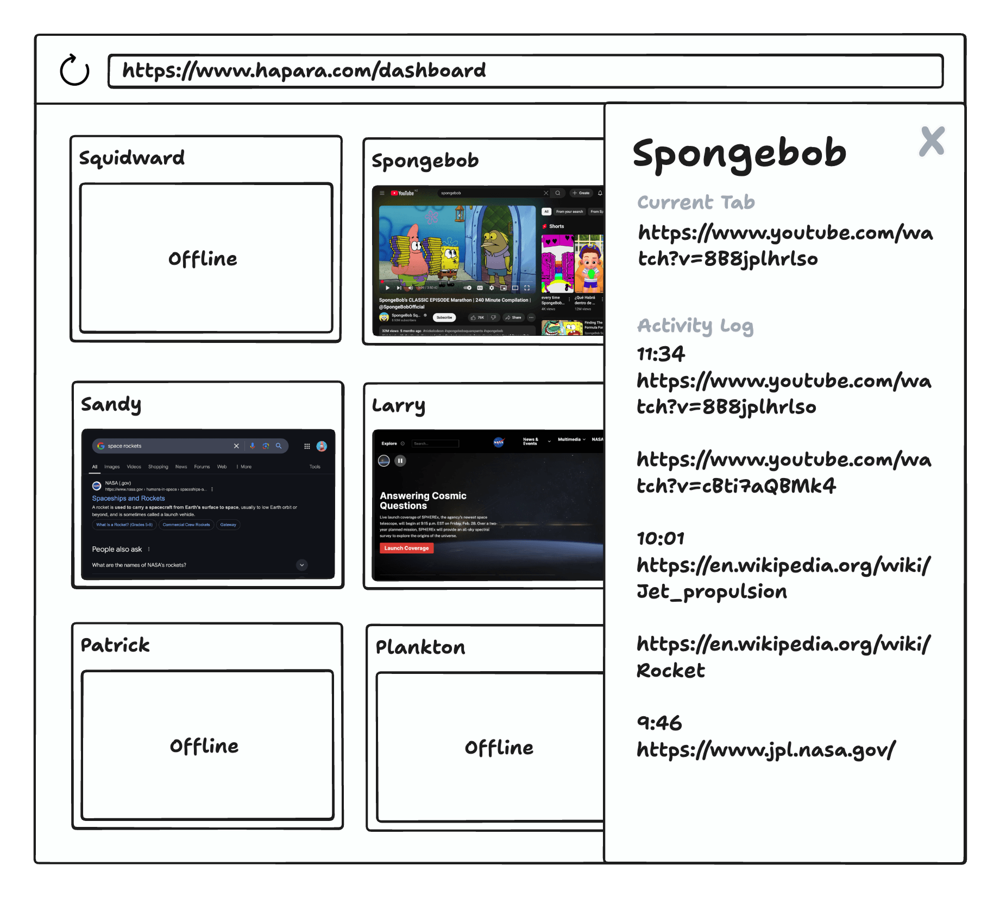

# Hāpara Frontend Assessment



## Requirements

Build the above dashboard using any front-end library or framework. Feel free to include any other tools, libraries, or utilities that help you.

The dashboard should display student tiles retrieved from a [mocked endpoint](#mock-json-server), with each tile showing:

- Student's name
- Connected status
- Timestamp in local time,
- Screenshot provided in `base64` by the mock endpoint

Only **online** students should be interactive. When selected, a drawer should open displaying the student's current URL and browsing history.

## Expectations

- Please do not spend more than 2 hours on this assessment.
- We are not expecting a perfectly polished UI — our focus is on how you structure your code, manage state, and handle data from the API.

## Mock JSON Server

A simple mock JSON server has been setup and this can be run with:

```sh
npm run server
```

You are welcome to modify or extend the mock server as needed. The server returns responses matching the following TypeScript types:

```typescript
// GET: http://localhost:3000/students
type StudentsResponse = Array<{
  id: string;
  name: string;
  status: "online" | "offline";
}>;

// GET: http://localhost:3000/students/:id
type StudentDetailsResponse = {
  id: string;
  name: string;
  currentUrl: string | null;
  currentScreen: string | null;
  history: Array<{
    timestamp: string;
    urls: string[];
  }>;
};
```

## Bonus Points ✨

- Render the tiles and the drawer responsively.
- Code your solution in TypeScript.
- Include unit tests on some of the components you've built.
- Implement error handling for cases where details aren't returned for an online student, i.e. id: `7283`.
- Show a placeholder image or message if `currentScreen` is `null`.

## Submission

- Push your changes to a public repository, or
- Zip your project files (excluding `node_modules`) and submit the archive to us.
